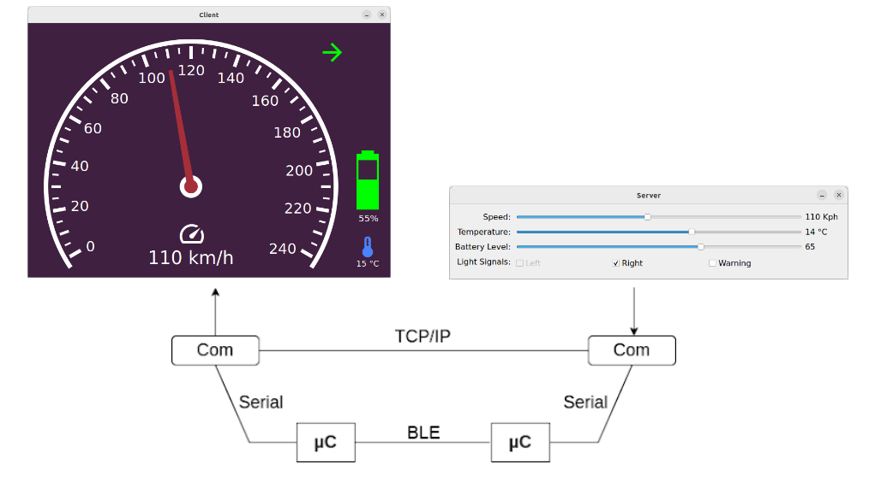
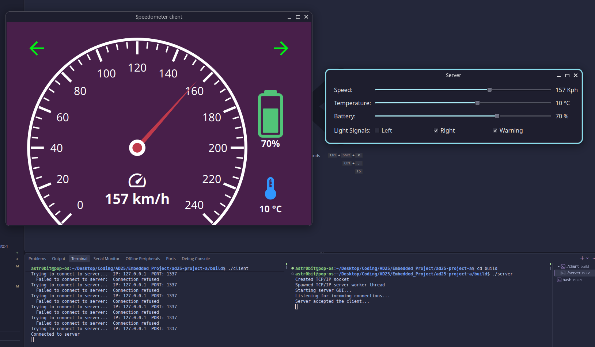

# Speedometer Project - Team A

## What it is

- This project is about creating a simulated speedometer using both desktop,   and embedded programming.
- This involves:
  - TCP / IP socket programming, and serial (UART) for desktop
  - Serial (UART) and BLE for embedded (ESP32)

- Read more about the project description [here](./readme/Project.pdf)

## Communication overview

## Prerequisites

- A computer with Ubuntu 24.04 LTS
- CMake, GNU Make, PlatformIO, ESP-IDF
- 2x esp32-c6-devkitc-1

## How to build

1. Clone the repository
2. Create a build directory in the project root, eg. `mkdir build`
3. Enter the build directory, eg. `cd build`, and run `cmake ..` to build the project

#### Running the TCP/IP target

1. To build the TCP/IP target, eg. completely on the machine itself, run `make use_tcp && make`
2. You should now have 2 binaries; `./client` and `./server`. Running those, in 2 separate terminals should get you something like this:

#### Running the UART/BLE target

1. To build the UART/BLE target, run `make use_uart && make`
2. Connect 2x esp32-c6-devkitc-1 to your computer
3. Upload the BLE server and client targets, eg. `make upload_server && make upload_client`
4. You should now see the onboard LED's of each ESP32 be a GREEN color, eg:  

5. Now that the ESP32's have their code, you can now run `./server` and `./client` just as before, and the behavior on your computer should be the same.

- NOTE:
  - When the BLE server is sending packets, it's onboard RGB led should be BLUE.
  - If you disconnect the BLE client, the RGB led on the BLE server should turn off completely.
